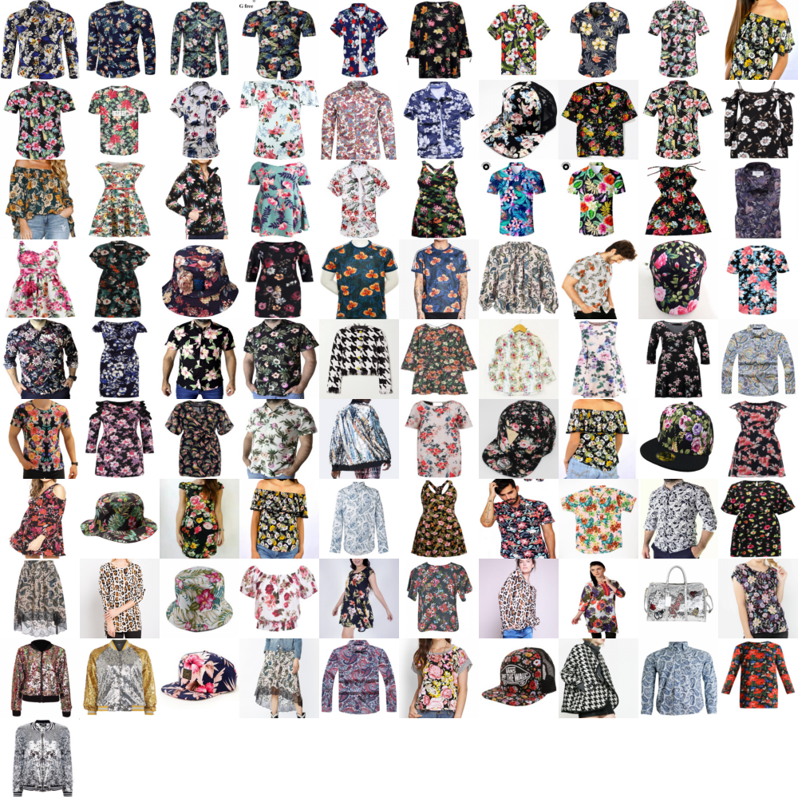

# Similarity Search
This project allows you to compute features and apply similarity search using a hidden layer of a ResNet50.

## Dependencies
This project depends on the project convnet2, that you can download from [here](https://github.com/jmsaavedrar/convnet2). So, you will need to set the local path of convnet2 at the top of the file [ssearch.py](ssearch.py).

## Compute Features of a Catalog
A catalog is a set of images used for querying. A catalog is defined by a text file listing all the filenames that you will process.

In addition, to make the configuration easier, a configuration file is required. This configuration file has many parameters, but you only need to pay attention to the following params:

* DATA_DIR: The directory where the data is stored. A folder named *ssearch* should exist, because it will contain all the data produced by the script.
* IMAGE_WIDTH:  Width of the input image.
* IMAGE_HEIGHT: Height of the input image.
* CHANNELS: Number of channels of the input.

You can find an example of this configuraction file in [resnet50.config](resnet50.config).

Finally, the command to compute the catalog is:
```
python ssearch.py -config resnet50.config -name RESNET -mode compute
```
where RESNET is the name of a section in the configuration file.

## Make a Query
For queryng you can use the following command:
```
python ssearch.py -config resnet50.config -name RESNET -mode search
```

As you can note, we only have changed the paramenter *mode* to *search*. After running the previous command, the sysmem will ask you for a filename, that is the input query.
```
Query: test_images/flower_1.jpg
```
For instance, you can use the test images that come with this project.  Then, the search engine will look for similar images and a collage with the results is genereted in the current folder. In this case the result is stored in the file flower_1.jpg_l2_result.png, where the first image is the query.




